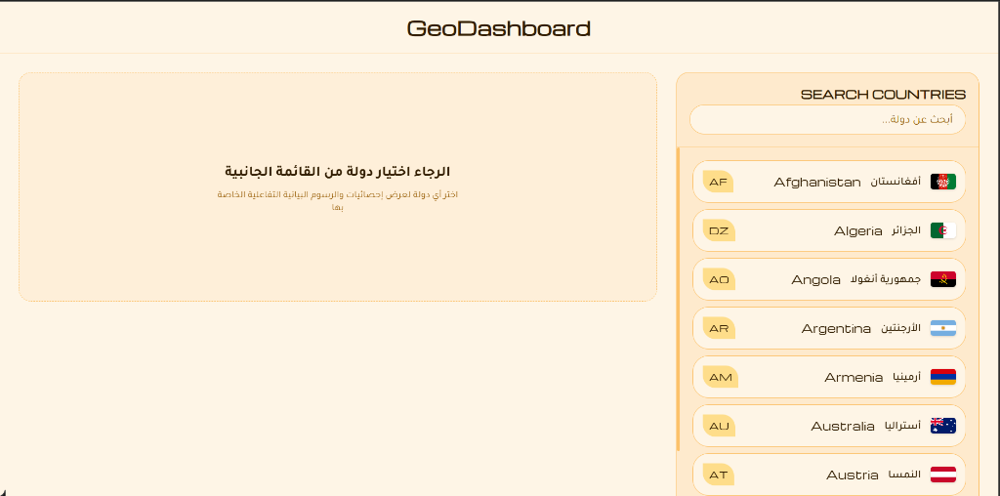

# 🗺️ مشروع لوحة البيانات الجغرافية (GeoDashboard)



تطبيق ويب متكامل (Full-Stack TypeScript Monorepo) لعرض واستكشاف معلومات الدول الجغرافية والإحصائية مثل المساحة، السكان، العملات، المناطق الزمنية، ومعامل جيني (توزيع الدخل) والخرائط التفاعلية.

يعتمد المشروع على هيكلية المستودع الموحد (Monorepo) المدار بواسطة **Turborepo** ويستخدم **Bun** كمدير حزم ومحرك تشغيل أساسي.

---

## 🛠️ البنية التقنية (Technology Stack)

يتكون المشروع من ثلاثة مساحات عمل (Workspaces) رئيسية:

1. **الواجهة الأمامية (`client`)**:
   - مبنية باستخدام **Vite + React (TypeScript)**.
   - التنسيق والتصميم باستخدام **Tailwind CSS v4** لتقديم واجهة مستخدم حديثة وسريعة.
   - مكتبة مكونات **shadcn/ui** المخصصة لتصميم واجهات تفاعلية وراقية.
   - خطوط العرض: خط `Tajawal` (للغة العربية) و `Michroma` (للغة الإنجليزية والعناوين).
   - استخدام مكتبة **Leaflet** للخرائط التفاعلية و **Recharts** للمخططات الإحصائية لمعامل جيني.

2. **الواجهة الخلفية (`server`)**:
   - مبنية باستخدام إطار عمل **Hono** السريع الخفيف.
   - التكامل مع مزود البيانات الخارجية: `https://api.restcountries.com/countries/v5`.
   - نظام كاش محلي في الذاكرة (JSON Cache) لمدة 3 أيام للحد من استهلاك حصة الـ API وتوفير استجابة فائقة السرعة.

3. **الأكواد المشتركة (`shared`)**:
   - يحتوي على تعريفات الأنواع (TypeScript Types) المشتركة بين الواجهة الأمامية والخلفية مثل `Country` و `CountryResponse` و `ApiResponse`.
   - قائمة الدول المميزة `TOP_COUNTRY_CODES` لفلترة وعرض الدول المهمة في القائمة الجانبية.

---

## 📂 هيكلية المجلدات

```bash
geoDashboard/
├── client/               # واجهة المستخدم (Vite + React)
│   ├── src/
│   │   ├── components/ui/# مكونات الواجهة (مثل card, details, maps...)
│   │   ├── lib/layout/   # الهيكل العام (مثل Sidebar, Header, Footer)
│   │   ├── App.tsx       # المكون الرئيسي للواجهة
│   │   ├── index.css     # التنسيقات العامة وتعريف ثيم Tailwind CSS v4
│   │   └── main.tsx      # نقطة دخول React
├── server/               # خادم الويب والـ API (Hono)
│   ├── src/
│   │   └── index.ts      # مسارات الـ API ومنطق الكاش واستدعاء REST Countries
├── shared/               # الأنواع والثوابت المشتركة
│   ├── src/
│   │   └── types/        # ملفات تعريف واجهات البيانات (Interfaces)
├── package.json          # إعدادات الـ Monorepo وحزم التطوير العامة
└── turbo.json            # إعدادات Turbo لبناء وتشغيل المشاريع
```

---

## 🚀 التشغيل والتطوير المحلي

تأكد من تثبيت **Bun** على جهازك قبل البدء.

### 1. إعداد متغيرات البيئة
أنشئ ملف `.env` داخل مجلد `server/` وأضف مفتاح الوصول لـ API:
```env
REST_COUNTRIES_API_KEY=your_api_key_here
```

### 2. تثبيت الحزم والمكونات
قم بتثبيت الحزم للمشروع بالكامل من المجلد الرئيسي:
```bash
bun install
```

### 3. تشغيل بيئة التطوير
لتشغيل السيرفر والواجهة الأمامية معاً في نفس الوقت:
```bash
bun run dev
```

أو لتشغيل جزء معين بشكل منفصل:
- **تشغيل الواجهة الأمامية فقط**: `bun run dev:client`
- **تشغيل السيرفر فقط**: `bun run dev:server`

### 4. بناء المشروع
لبناء المشروع بالكامل للإنتاج:
```bash
bun run build
```
وإذا قمت بتعديل الأنواع داخل مجلد `shared`، يجب إعادة بناء الحزمة المشتركة لكي تتعرف عليها المساحات الأخرى:
```bash
bun run build --filter=shared
```

---

## 📋 الأوامر البرمجية المتاحة (Scripts)

- `bun run type-check`: فحص صحة أنواع TypeScript في كافة المشاريع.
- `bun run lint`: فحص وتصحيح جودة الكود (ESLint).
- `bun run test`: تشغيل الاختبارات البرمجية.
